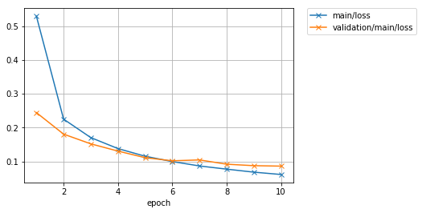
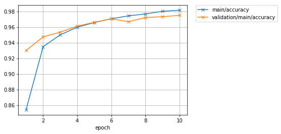
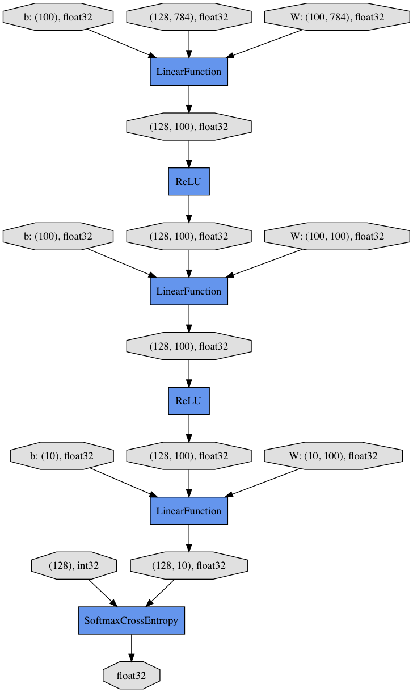

# 让我们尝试使用训练器的功能

通过使用Trainer，您不需要再显式的编写训练循环。此外，Chainer还提供了很多有用的扩展，可以与Trainer一起使用，以便更直观地显示结果，评估模型，存储和管理日志文件。

本例将展示如何使用训练器在MNIST数据集上训练一个完全连接的前馈神经网络。


> 如果你想知道如何编写训练循环而不使用训练器，请参阅如何在Chainer中编写训练循环，而不是使用本教程。


```python
import numpy as np
import chainer
from chainer import cuda, Function, gradient_check, report, training, utils, Variable
from chainer import datasets, iterators, optimizers, serializers
from chainer import Link, Chain, ChainList
import chainer.functions as F
import chainer.links as L
from chainer.training import extensions
```

## 1. 准备数据集

加载MNIST数据集，其中包含一组训练图像和类标签以及相应的测试集。


```python
from chainer.datasets import mnist

train, test = mnist.get_mnist()
```

>您可以使用Python列表作为数据集。这是因为迭代器可以将任何对象作为一个数据集，其元素可以通过[]访问器访问，并且可以使用len（）函数获取其长度。例如，You can use a Python list as a dataset. That’s because Iterator can take any object as a dataset whose 

>```
 train = [(x1, t1), (x2, t2), ...]
 ```
这样的元组列表可以用作数据集。

>数据集中定义了许多实用工具数据集类。建议在实际应用中使用它们。

>例如，如果数据集由多个图像文件组成，则需要大量的内存才能将这些数据加载到上面的列表中。在这种情况下，您可以使用ImageDataset，它只保留图像文件的路径。当通过[]访问器请求相应的元素时，实际的图像数据将从磁盘加载。在此之前，不会将图像加载到内存以减少内存使用。

## 2. 准备数据集迭代

迭代器根据给定的数据集创建一个小批量。


```python
batchsize = 128

train_iter = iterators.SerialIterator(train, batchsize)
test_iter = iterators.SerialIterator(test, batchsize, False, False)
```

## 3. 准备模型

在这里，我们将使用与如何在Chainer中编写训练循环中定义的模型相同的模型。


```python
class MLP(Chain):

    def __init__(self, n_mid_units=100, n_out=10):
        super(MLP, self).__init__()
        with self.init_scope():
            self.l1 = L.Linear(None, n_mid_units)
            self.l2 = L.Linear(None, n_mid_units)
            self.l3 = L.Linear(None, n_out)

    def __call__(self, x):
        h1 = F.relu(self.l1(x))
        h2 = F.relu(self.l2(h1))
        return self.l3(h2)

gpu_id = 0  # Set to -1 if you use CPU

model = MLP()
if gpu_id >= 0:
    model.to_gpu(gpu_id)
```

##  4. 准备更新器

Trainer 是一个拥有训练所需的所有必要组件的类。 主要组件如下所示。


基本上，所有你需要传递给 `Trainer` 是一个 `Updater`。然而，`Updater` 含有 `Iterator` 和 `Optimizer`。 由于 `Iterator` 访问数据集并且 `Optimizer` 拥有模型的参考， `Updater` 可以访问模型以及更新参数。

所以， `Updater` 可以依照下列方式进行训练过程:

1. 从数据集中检索数据并构建一个小批量 (`Iterator`)
2. 将小批量传递给模型并计算损失
3. 更新模型的参数 (`Optimizer`)

现在我们来创建 `Updater` 对象 !


```python
max_epoch = 10

# Wrapp your model by Classifier and include the process of loss calculation within your model.
# Since we do not specify a loss funciton here, the default 'softmax_cross_entropy' is used.
model = L.Classifier(model)

# selection of your optimizing method
optimizer = optimizers.MomentumSGD()

# Give the optimizer a reference to the model
optimizer.setup(model)

# Get an updater that uses the Iterator and Optimizer
updater = training.StandardUpdater(train_iter, optimizer, device=gpu_id)
```

在这里，上面定义的模型被传递给 Classifier 并更改为一个新的Chain。实际上从 Chain 类继承的 Classifier 将给定的 Chain 模型保留在其预测器属性中。一旦通过（）运算符将输入数据和相应的类标签提供给模型， 

1. 调用模型的`__call__()`。数据然后被提供给预测器以获得输出`y`。
2. 接下来，与给定的标签一起，输出`y`被传递给在`Classifier`的构造函数中由`lossfun`参数确定的损失函数。
3. 损失作为 `Variable` 返回。

在分类器中，lossfun默认设置为`softmax_cross_entropy()`。

StandardUpdater是几个更新程序中最简单的一个类。还有ParallelUpdater和MultiprocessParallelUpdater使用多个GPU。 MultiprocessParallelUpdater使用NVIDIA NCCL库，因此在使用之前需要安装NCCL并重新安装CuPy。

## 5. 设置训练器

最后，我们将设置训练器。创建Trainer的唯一要求是传递我们以前创建的Updater对象。你也可以将`stop_trigger`传递给第二个训练参数，像`（length，unit）`这样的元组告诉训练器何时停止训练。 长度以整数形式给出，单位以字符串形式给出，应该是epoch或者迭代。没有设置stop_trigger，训练永远不会停止。


```python
# Setup a Trainer
trainer = training.Trainer(updater, (max_epoch, 'epoch'), out='mnist_result')
```

`out`参数指定用于保存日志文件的输出目录，在使用`PlotReport`扩展，图像所绘制的随不同迭代得到的损失，准确度等。 接下来，我们将解释如何使用训练`Extension`来显示或保存这些信息。

## 6. 将扩展添加到训练器对象

Trainer 扩展提供以下功能:

* 自动保存日志文件 (`LogReport`)
* 定期向终端显示训练信息 (`PrintReport`)
* 定期绘制一个图形来显示损失的进展，并将其保存为一个图像文件 (`PlotReport`)
* 定期自动序列化状态 (`snapshot()` / `snapshot_object()`)
* 显示进度条到终端显示训练进度 (`ProgressBar`)
* 将模型结构保存为Graphviz的dot文件 (`dump_graph()`)

要为您的训练任务使用各种各样的工具，请将扩展对象传递给`Trainer`对象的`extend()`方法。


```python
trainer.extend(extensions.LogReport())
trainer.extend(extensions.snapshot(filename='snapshot_epoch-{.updater.epoch}'))
trainer.extend(extensions.snapshot_object(model.predictor, filename='model_epoch-{.updater.epoch}'))
trainer.extend(extensions.Evaluator(test_iter, model, device=gpu_id))
trainer.extend(extensions.PrintReport(['epoch', 'main/loss', 'main/accuracy', 'validation/main/loss', 'validation/main/accuracy', 'elapsed_time']))
trainer.extend(extensions.PlotReport(['main/loss', 'validation/main/loss'], x_key='epoch', file_name='loss.png'))
trainer.extend(extensions.PlotReport(['main/accuracy', 'validation/main/accuracy'], x_key='epoch', file_name='accuracy.png'))
trainer.extend(extensions.dump_graph('main/loss'))
```

## LogReport

每创建一个Trainer对象，都会自动收集每个epoch 或迭代的损失和准确性，并将这些信息存储在out参数指定的目录下的日志文件中。


## snapshot()

snapshot（）方法在由out指定的目录中的指定时间（缺省：每个epoch）保存Trainer对象。 如前所述，Trainer对象具有一个Updater，其中包含一个Optimizer和一个模型。因此，只要你有快照文件，你可以使用它来回到训练或稍后使用先前训练的模型进行推理。

## snapshot_object()


但是，当您保留整个训练器对象时，在某些情况下，仅检索模型的内部是非常繁琐的。通过使用`snapshot_object()`，您可以将特定对象（在本例中为`Classifier`包装的模型）保存为分隔快照。`Classifier` 是一个`Chain` 对象，它保持`Chain`对象的模型作为其预测属性，所有的参数都在预测器之下，所以取预测器的快照足以保持所有的训练参数。


## dump_graph()

这种方法保存了模型的计算图的结构。图形保存在Graphviz  <http://www.graphviz.org/> 的dot文件。 保存图形的输出位置（目录）由 `Trainer`的`out`参数设定.

## Evaluator

使用评估数据集和模型对象的迭代器需要使用Evaluator。它使用给定数据集（通常是验证数据集）在指定的时间间隔内评估模型。


## PrintReport
它将指定值输出到标准输出。

## PlotReport
PlotReport绘制由其参数指定的值将其保存为与file_name参数具有相同名称的图像文件。

每个 Extension 有不同的选项，这里没有提到一些扩展。而其他重要功能之一是，例如，通过使用 trigger 选项，您可以设置个别时间来触发扩展。要了解所有扩展的更多细节，请查看官方文档：训练器的扩展。

## 7. 开始训练

从Trainer对象调用 run() 方法便开始训练过程。


```python
trainer.run()
```

    epoch       main/loss   main/accuracy  validation/main/loss  validation/main/accuracy  elapsed_time
    1           0.529012    0.854044       0.244404              0.930083                  4.24566       
    2           0.225027    0.934935       0.180788              0.947389                  6.22003       
    3           0.170565    0.95006        0.152106              0.953619                  8.17193       
    4           0.138124    0.959953       0.130716              0.961234                  10.4198       
    5           0.115512    0.965868       0.111221              0.966179                  12.8056       
    6           0.0997647   0.970749       0.102037              0.970629                  14.7598       
    7           0.0868169   0.974447       0.104645              0.96697                   16.7009       
    8           0.077382    0.97693        0.0919869             0.97231                   18.6629       
    9           0.0685005   0.980327       0.0876435             0.973398                  20.6416       
    10          0.0615838   0.981693       0.0862914             0.975079                  22.5988       


让我们看看保存在mnist_result目录中的损失进度情况。



准确率如何？

 

此外，让我们使用Graphviz可视化保存在dump_graph（）中的计算图。


```python
!dot -Tpng mnist_result/cg.dot -o mnist_result/cg.png
```



从顶部到底部，您可以在计算图中看到数据流。它基本上显示了数据和参数如何传递给函数。

## 8. 评估预训练的模型

使用模型快照进行评估与在Chainer中编写训练循环的方法一样简单。


```python
%matplotlib inline
```


```python
import matplotlib.pyplot as plt

model = MLP()
serializers.load_npz('mnist_result/model_epoch-10', model)

# Show the output
x, t = test[0]
plt.imshow(x.reshape(28, 28), cmap='gray')
plt.show()
print('label:', t)

y = model(x[None, ...])

print('predicted_label:', y.data.argmax(axis=1)[0])
```


    label: 7
    predicted_label: 7


预测看起来是正确的。成功！
