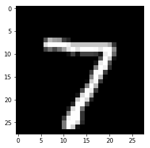

# 生成网络
我们在前面章节中看到的所有示例都侧重于解决诸如分类或回归之类的问题。 本章对于理解深度学习如何在无监督学习中解决问题非常有意义和重要。
在本章中，我们将培训学习如何创建的网络：

* 基于内容和特定艺术风格的图像，通常称为风格迁移
* 使用特定类型的生成对抗来生成新的面孔网络（GAN）
* 使用语言建模生成新文本


这些技术构成了深度学习领域中发生的大多数高级研究的基础。 进入每个子部分的具体细节，例如GAN和语言建模，都不属于本书的范围，因为它们本身应该有一本单独的书。 我们将了解它们如何工作以及在PyTorch中构建它们的过程。

## 神经风格迁移

我们人类可以生成具有不同精度和复杂程度的艺术作品。虽然创作艺术的过程可能是一个非常复杂的过程，但它可以看作是两个最重要因素的结合，即画什么和如何画。绘制的内容受到我们周围所看到的内容的启发，我们绘制的内容也会受到我们周围某些事物的影响。从艺术家的角度来看，这可能过于简单了，但是为了理解我们如何使用深度学习算法创建艺术作品，它非常有用。我们将训练深度学习算法从一个图像中获取内容，然后根据特定的艺术风格绘制它。如果您是艺术家或创意产业，您可以直接使用近年来的令人惊叹的研究来改进这一点并在您工作的领域内创造一些很酷的东西。即使您不是，它仍然会向您介绍生成模型领域，网络生成的新内容。

让我们了解在高级别的神经风格转移中做了什么，然后深入细节，以及构建它所需的PyTorch代码。 样式转移算法具有内容图像（C）和样式图像（S）; 该算法必须生成新图像（O），其具有来自内容图像的内容和来自样式图像的样式。 这个创建神经风格转移的过程由Leon Gates和其他人在2015年（A Neural Algorithm of Artistic style）引入。 以下是我们将使用的内容图像（C）：

以下是样式图像（S）：


这是我们要生成的图像：


```python
from torchvision.models import vgg19
from torch.autograd import Variable
from collections import OrderedDict
import torch
import torch.nn as nn
import torch.optim as optim
import torchvision.transforms as transforms
from PIL import Image
%pylab inline

```

    Populating the interactive namespace from numpy and matplotlib


风格迁移背后的想法从理解卷积神经网络（CNN）如何工作变得直观。当CNN被训练用于对象识别时，训练好的的CNN的早期层学习非常通用的信息，如线，曲线和形状。 CNN中的最后一层从图像（例如眼睛，建筑物和树木）捕获更高级别的概念。因此，相似图像的最后层的值往往更接近。我们采用相同的概念并将其应用于内容丢失。内容图像和生成的图像的最后一层应该相似，我们使用均方误差（MSE）计算相似度。我们使用我们的优化算法来降低损失值。

通常通过称为Gram矩阵的技术在CNN中跨多个层捕获图像的样式。 Gram矩阵计算跨多个层捕获的要素图之间的相关性。 Gram矩阵给出了计算样式的度量。类似的样式图像具有类似于Gram 矩阵的值。还使用样式图像的Gram 矩阵与生成的图像之间的MSE来计算样式损失。

我们将使用torchvision模型中提供的预训练VGG19模型。训练样式转移模型所需的步骤与任何其他深度学习模型类似，除了计算损失比分类或回归模型更复杂的事实。神经风格算法的训练可以分解为以下步骤：

1.加载数据。

2.创建VGG19模型。

3.定义内容丢失。

4.定义风格损失。

5.从VGG模型中提取跨层的损失。

6.创建优化程序。

7.训练 - 生成类似于内容图像的图像，并且样式类似于风格形象。

## 加载数据

加载数据类似于我们在第5章“计算机视觉的深度学习”中解决图像分类问题所看到的。 我们将使用预训练的VGG模型，因此我们必须使用训练预训练模型的相同值来标准化图像。

以下代码显示了我们如何做到这一点。 代码大多是不言自明的，因为我们已在前面的章节中详细讨论过它：


```python
imsize = 512 
is_cuda = torch.cuda.is_available()

prep = transforms.Compose([transforms.Resize(imsize),
                           transforms.ToTensor(),
                           transforms.Lambda(lambda x: x[torch.LongTensor([2,1,0])]), #turn to BGR
                           transforms.Normalize(mean=[0.40760392, 0.45795686, 0.48501961], #subtract imagenet mean
                                                std=[1,1,1]),
                           transforms.Lambda(lambda x: x.mul_(255)),
                          ])
postpa = transforms.Compose([transforms.Lambda(lambda x: x.mul_(1./255)),
                           transforms.Normalize(mean=[-0.40760392, -0.45795686, -0.48501961], #add imagenet mean
                                                std=[1,1,1]),
                           transforms.Lambda(lambda x: x[torch.LongTensor([2,1,0])]), #turn to RGB
                           ])
postpb = transforms.Compose([transforms.ToPILImage()])
def postp(tensor): # to clip results in the range [0,1]
    t = postpa(tensor)
    t[t>1] = 1    
    t[t<0] = 0
    img = postpb(t)
    return img
```

在此代码中，我们定义了三个功能，prep执行所需的所有预处理，并使用与VGG模型训练的标准化相同的值进行标准化。 模型的输出需要归一化回原始值; postpa函数执行所需的处理。 生成的模型可能超出了可接受值的范围，并且postp函数将所有大于1的值限制为小于0到0的值。最后，image_loader函数加载图像，应用预处理转换， 并将其转换为变量。 以下函数加载样式和内容图像：


```python
def image_loader(image_name):
    image = Image.open(image_name)
    image = Variable(prep(image))
    # fake batch dimension required to fit network's input dimensions
    image = image.unsqueeze(0)
    return image
```


```python
Image.open('Images/amrut1.jpg').resize((600,600))
```


我们将使用优化器调整opt_img的值，以使图像更接近内容图像和样式图像。 出于这个原因，我们要求PyTorch通过提及requires_grad = True来维持梯度渐变。我们可以创建带有噪声的图像（随机数），也可以使用相同的内容图像。 在这种情况下，我们将使用内容图像。 以下代码创建内容图像：


```python
style_img = image_loader("Images/vangogh_starry_night.jpg")
content_img = image_loader("Images/amrut1.jpg")
vgg = vgg19(pretrained=True).features
for param in vgg.parameters():
    param.requires_grad = False
if is_cuda:
    style_img = style_img.cuda()
    content_img = content_img.cuda()
    vgg = vgg.cuda()

opt_img = Variable(content_img.data.clone(),requires_grad=True)

```

## 创建VGG模型

我们将从torchvisions.models加载一个预训练模型。 我们将仅使用此模型来提取特征，并且PyTorch VGG模型以这样的方式定义：所有卷积块将在特征模块中，并且完全连接或线性的层在分类器模块中。 由于我们不会训练VGG模型中的任何权重或参数，我们也会冻结模型。 以上代码演示了相同的内容。在这段代码中，我们创建了一个VGG模型，仅使用其卷积块并冻结模型的所有参数，因为我们仅将其用于提取特征。


```python


```

## 风格损失
样式损失是跨多个层计算的。 样式丢失是为每个要素图生成的gram 矩阵的MSE。 gram 矩阵表示其特征的相关值。 让我们通过使用下图和代码实现来理解gram矩阵是如何工作的。
下表显示了维度[2,3,3,3]的要素图的输出，其中包含列属性Batch_size，Channels和Values：

为了计算Gram 矩阵，我们将每个通道的所有值展平，然后通过乘以其转置来找到相关性，如下表所示：

我们所做的就是将每个通道的所有值平坦化为单个向量或张量。 以下代码实现了这个：


```python
class GramMatrix(nn.Module):
    
    def forward(self,input):
        b,c,h,w = input.size()
        features = input.view(b,c,h*w)
        gram_matrix =  torch.bmm(features,features.transpose(1,2))
        gram_matrix.div_(h*w)
        return gram_matrix
```

我们将GramMatrix实现为具有前向功能的另一个PyTorch模块，以便我们可以像PyTorch一样使用它。我们从这一行的输入图像中提取不同的维度：

```python
b，c，h，w = input.size()
```

这里，`b`表示批次，`c`表示过滤器或通道，`h`表示高度，`w`代表宽度。在下一步中，我们将使用以下代码来保持批次和通道尺寸的完整性，并沿高度和宽度尺寸展平所有值，如上图所示：
```python
features = input.view(b，c，h * w)
```

通过将平坦值与其转置矢量相乘来计算克矩阵。我们可以使用PyTorch批处理矩阵乘法函数来实现，该函数以torch.bmm（）的形式提供，如下面的代码所示：
```python
gram_matrix = torch.bmm(features，features.transpose(l，2))
```

我们通过将它除以元素的数量来完成对克矩阵的值的标准化。这可以防止具有大量值的特定特征图占据分数。计算GramMatrix后，计算样式丢失变得简单，这在以下代码中实现：


```python
class StyleLoss(nn.Module):
    
    def forward(self,inputs,targets):
        out = nn.MSELoss()(GramMatrix()(inputs),targets)
        return (out)
```

StyleLoss实现为另一个PyTorch层。 它计算输入GramMatrix值和样式图像GramMatrix值之间的MSE。

## 提取损失
就像我们使用第5章“计算机视觉的深度学习”中的register_forward_hook()函数提取卷积层的激活一样，我们可以提取计算样式丢失和内容丢失所需的不同卷积层的损失。 在这种情况下的一个区别是，我们需要提取多个层的输出，而不是从一个层中提取。 以下类集成了所需的更改：


```python
style_layers = [1,6,11,20,25]
content_layers = [21]
loss_layers = style_layers + content_layers

class LayerActivations():
    features=[]
    
    def __init__(self,model,layer_nums):
        
        self.hooks = []
        for layer_num in layer_nums:
            self.hooks.append(model[layer_num].register_forward_hook(self.hook_fn))
    
    def hook_fn(self,module,input,output):
        self.features.append(output)

    
    def remove(self):
        for hook in self.hooks:
            hook.remove()
        
```

`__init__`方法采用我们需要调用`register_forward_hook`方法的模型以及我们需要提取输出的层数。 `__init__`方法中的for循环遍历层数并注册提取输出所需的前向钩子。
传递给`register_forward_hook`方法的`hook_fn`之后由PyTorch调用
`hook_fn`函数注册的层。 在函数内部，我们捕获输出并将其存储在`features`数组中。

当我们不想捕获输出时，我们需要调用一次remove函数。忘记调用remove方法可能会导致内存不足异常输出累积。

让我们编写另一个实用函数，它可以提取样式和所需的输出内容图片。 以下功能也是如此：


```python
def extract_layers(layers,img,model=None):
    la = LayerActivations(model,layers)
    #Clearing the cache 
    la.features = []
    out = model(img)
    la.remove()
    return la.features
```

在extract_layers函数内部，我们通过传入模型和图层编号为LayerActivations类创建对象。 功能列表可能包含先前运行的输出，因此我们将重新启动到空列表。 然后我们通过模型传递图像，我们不会使用输出。 我们对features数组中生成的输出更感兴趣。 我们调用remove方法从模型中删除所有已注册的钩子并返回功能。 一旦我们提取目标，我们需要从创建它们的图形中分离输出。 请记住，所有这些输出都是PyTorch变量，它们保存有关如何创建它们的信息。 但是，对于我们的情况，我们只对输出值而不是图表感兴趣，因为我们不会更新样式图像或内容图像。 以下代码显示了我们如何提取样式和内容图像所需的目标：


```python
content_targets = extract_layers(content_layers,content_img,model=vgg)
content_targets = [t.detach() for t in content_targets]
style_targets = extract_layers(style_layers,style_img,model=vgg)
style_targets = [GramMatrix()(t).detach() for t in style_targets]
targets = style_targets + content_targets
```

一旦我们分离了，让我们将所有目标添加到一个列表中。

在计算样式丢失和内容丢失时，我们传递了两个名为content的列表
图层和样式图层。不同的层选择将对质量产生影响
图像生成。让我们选择与论文作者提到的相同的层次。以下代码显示了我们在此处使用的图层选择：

```python
style_layers = [1,6,11,20,25]
content_layers = [21]
loss_layers = style_layers + content_layers
```

优化器期望单个标量数量最小化。为了获得单个标量值，我们总结了到达不同层的所有损失。通常的做法是对这些损失进行加权求和，并再次选择与GitHub存储库中的文件实现中使用的相同权重（https://github.com/leongatys/PytorchNeuralstyleTransfer ）。我们的实现是作者实现的略微修改版本。以下代码描述了所使用的权重，这些权重是通过所选层中的过滤器数量计算得出的：


```python
#these are good weights settings:
style_weights = [1e3/n**2 for n in [64,128,256,512,512]]
content_weights = [1e0]
weights = style_weights + content_weights
```

为了使其可视化，我们可以打印VGG图层。 花一点时间观察我们正在抽取的图层，您可以尝试不同的图层组合。 我们将使用以下代码打印VGG图层：


```python
print(vgg)
```

    Sequential(
      (0): Conv2d(3, 64, kernel_size=(3, 3), stride=(1, 1), padding=(1, 1))
      (1): ReLU(inplace)
      (2): Conv2d(64, 64, kernel_size=(3, 3), stride=(1, 1), padding=(1, 1))
      (3): ReLU(inplace)
      (4): MaxPool2d(kernel_size=2, stride=2, padding=0, dilation=1, ceil_mode=False)
      (5): Conv2d(64, 128, kernel_size=(3, 3), stride=(1, 1), padding=(1, 1))
      (6): ReLU(inplace)
      (7): Conv2d(128, 128, kernel_size=(3, 3), stride=(1, 1), padding=(1, 1))
      (8): ReLU(inplace)
      (9): MaxPool2d(kernel_size=2, stride=2, padding=0, dilation=1, ceil_mode=False)
      (10): Conv2d(128, 256, kernel_size=(3, 3), stride=(1, 1), padding=(1, 1))
      (11): ReLU(inplace)
      (12): Conv2d(256, 256, kernel_size=(3, 3), stride=(1, 1), padding=(1, 1))
      (13): ReLU(inplace)
      (14): Conv2d(256, 256, kernel_size=(3, 3), stride=(1, 1), padding=(1, 1))
      (15): ReLU(inplace)
      (16): Conv2d(256, 256, kernel_size=(3, 3), stride=(1, 1), padding=(1, 1))
      (17): ReLU(inplace)
      (18): MaxPool2d(kernel_size=2, stride=2, padding=0, dilation=1, ceil_mode=False)
      (19): Conv2d(256, 512, kernel_size=(3, 3), stride=(1, 1), padding=(1, 1))
      (20): ReLU(inplace)
      (21): Conv2d(512, 512, kernel_size=(3, 3), stride=(1, 1), padding=(1, 1))
      (22): ReLU(inplace)
      (23): Conv2d(512, 512, kernel_size=(3, 3), stride=(1, 1), padding=(1, 1))
      (24): ReLU(inplace)
      (25): Conv2d(512, 512, kernel_size=(3, 3), stride=(1, 1), padding=(1, 1))
      (26): ReLU(inplace)
      (27): MaxPool2d(kernel_size=2, stride=2, padding=0, dilation=1, ceil_mode=False)
      (28): Conv2d(512, 512, kernel_size=(3, 3), stride=(1, 1), padding=(1, 1))
      (29): ReLU(inplace)
      (30): Conv2d(512, 512, kernel_size=(3, 3), stride=(1, 1), padding=(1, 1))
      (31): ReLU(inplace)
      (32): Conv2d(512, 512, kernel_size=(3, 3), stride=(1, 1), padding=(1, 1))
      (33): ReLU(inplace)
      (34): Conv2d(512, 512, kernel_size=(3, 3), stride=(1, 1), padding=(1, 1))
      (35): ReLU(inplace)
      (36): MaxPool2d(kernel_size=2, stride=2, padding=0, dilation=1, ceil_mode=False)
    )


## 为每个层创建损失函数

我们已经将损失函数定义为PyTorch层。 因此，让我们为不同的风格损失和内容损失创建损失层。 loss_fns是一个列表，包含一堆样式丢失对象和基于所创建数组长度的内容丢失对象。以下代码定义了该函数：


```python
loss_fns = [StyleLoss()] * len(style_layers) + [nn.MSELoss()] * len(content_layers)
if is_cuda:
    loss_fns = [fn.cuda() for fn in loss_fns]
```

## 创建优化程序
通常，我们传递像VGG这样的网络参数进行训练。 但是，在此示例中，我们使用VGG模型作为特征提取器，因此，我们无法传递VGG参数。 在这里，我们将仅提供我们将优化的opt_img变量的参数，以使图像具有所需的内容和样式。 以下代码创建优化其值的优化器：


```python
optimizer = optim.LBFGS([opt_img])
```

现在我们有了训练所需的所有组件。

## 训练

与我们迄今为止训练的其他模型相比，训练方法不同。 在这里，我们需要计算多层的损失，以及每次优化器
调用后，它将更改输入图像，使其内容和样式接近目标内容和风格。 让我们看一下用于训练的代码，然后我们将逐步介绍
培训的重要步骤：


```python

#run style transfer
max_iter = 500
show_iter = 50

n_iter=[0]

while n_iter[0] <= max_iter:

    def closure():
        optimizer.zero_grad()
        
        out = extract_layers(loss_layers,opt_img,model=vgg)
        layer_losses = [weights[a] * loss_fns[a](A, targets[a]) for a,A in enumerate(out)]
        loss = sum(layer_losses)
        loss.backward()
        n_iter[0]+=1
        #print loss
        if n_iter[0]%show_iter == (show_iter-1):
            print('Iteration: %d, loss: %f'%(n_iter[0]+1, loss.data.item()))

        return loss
    
    optimizer.step(closure)
    

```

    Iteration: 50, loss: 26043.576172
    Iteration: 100, loss: 13674.988281
    Iteration: 150, loss: 11287.914062
    Iteration: 200, loss: 10558.317383
    Iteration: 250, loss: 10203.455078
    Iteration: 300, loss: 10011.093750
    Iteration: 350, loss: 9884.095703
    Iteration: 400, loss: 9795.749023
    Iteration: 450, loss: 9725.958008
    Iteration: 500, loss: 9673.065430


我们正在运行500次迭代的训练循环。 对于每次迭代，我们使用extract_layers函数计算VGG模型的不同层的输出。 在这种情况下，唯一改变的是opt_img的值，它将包含我们的样式图像。 一旦计算出输出，我们就会通过迭代输出并将它们与各自的目标一起传递给相应的损失函数来计算损失。 我们汇总所有损失并调用backward函数。 在closure函数结束时，返回损失。 调用closure方法以及max_iter的optimizer.step方法。 如果您在GPU上运行，可能需要几分钟才能运行; 如果您在CPU上运行，请尝试缩小图像的大小以使其运行得更快。

运行500个 epoch 后，我机器上生成的图像如下所示。 尝试不同的内容和样式组合，以生成有趣的图像：


```python
#display result
out_img_hr = postp(opt_img.data[0].cpu().squeeze())

imshow(out_img_hr)
gcf().set_size_inches(10,10)
```


在下一节中，让我们继续使用深度卷积生成对抗网络（DCGAN）生成图像。

#  生成对抗性网络

GAN在过去几年中变得非常流行。每周都会在GAN区域取得一些进展。它已经成为深度学习的重要子领域之一，拥有一个非常活跃的研究社区。 GAN由Ian Goodfellow于2014年推出, GAN通过训练两个深度神经网络（称为生成器和鉴别器）来解决无监督学习的问题，这两个神经网络相互竞争。在培训过程中，两者最终都会在他们执行的任务中变得更好。

使用伪造者（生成器）和警察（鉴别器）的情况可以直观地理解GAN。最初，伪造者向警方展示假钱。警察认为它是假的，并向伪造者解释为什么它是假的。伪造者根据收到的反馈制作新的假钱。警方发现它是假的，并通知伪造者为什么是假的。它重复了这么多次，直到伪造者能够伪造警察无法识别的假钱。在GAN场景中，我们最终得到了一个生成伪造图像的生成器，这些伪造图像与真实图像非常相似，并且分类器在识别真实物体中的伪造品方面变得非常棒。


```python
import os
from torchvision import datasets
from torch.utils.data import DataLoader
import torch.nn as nn
import torch
from torch.autograd import Variable
import torch.optim as optim
import torchvision.transforms as transforms
import matplotlib.pyplot as plt
from PIL import Image
import torchvision.utils as vutils
%matplotlib inline
```

GAN是伪造网络和专家网络的组合，每个都经过训练以击败对方。 生成器网络将随机向量作为输入并生成合成图像。 鉴别器网络获取输入图像并预测图像是真实的还是假的。 我们将鉴别器网络传递为真实图像或伪图像。

生成器网络经过训练以产生图像并欺骗鉴别器网络使其相信它们是真实的。 由于我们在训练时传递反馈，因此鉴别器网络也在不被愚弄时不断改进。 尽管GAN的理念在理论上听起来很简单，但训练实际工作的GAN模型非常困难。 训练GAN也具有挑战性，因为有两个需要训练的深度神经网络。

>DCGAN是早期模型之一，它演示了如何构建一个自学习并生成有意义图像的GAN模型。 您可以在此处了解更多信息：
https://arxiv.org/pdf/1511.06434.pdf

下图显示了GAN的体系结构


我们将介绍这个体系结构的每个组件，以及它们背后的一些原理，然后我们将在下一节中在PyTorch中实现相同的流程。到实施结束时，我们将了解DCGAN的工作原理。

## 深卷积GAN
在本节中，我们将基于前面信息框中提到的DCGAN，实施GAN架构训练的不同部分。训练DCGAN的一些重要部分包括：

* 生成器网络，将某些固定维度的潜在向量（数字列表）映射到某种形状的图像。在我们的实现中，形状是（3,64,64）。
* 鉴别器网络，它将生成器或实际数据集生成的图像作为输入，并映射到评估输入图像是真实还是假的分数。
* 定义发生器和鉴别器的损耗函数。
* 定义优化程序。
* 训练GAN。

让我们详细探讨这些部分。实现基于代码，
这可以在PyTorch示例中找到：
https://github.com/pytorch/examples/tree/master/dcgan

## 载入数据


```python
img_size = 64
batch_size=64
lr = 0.0002
beta1 = 0.5
niter= 25
outf= 'output'

dataset = datasets.CIFAR10( root = 'data',download=True,
                       transform=transforms.Compose([
                           transforms.Resize(img_size),
                           transforms.ToTensor(),
                           transforms.Normalize((0.5, 0.5, 0.5), (0.5, 0.5, 0.5)),
                       ]))
dataloader = torch.utils.data.DataLoader(dataset, batch_size,
                                         shuffle=True)

```

    Downloading https://www.cs.toronto.edu/~kriz/cifar-10-python.tar.gz to data/cifar-10-python.tar.gz


# 定义生成器网络

生成器网络采用固定维度的随机向量作为输入，并对其应用一组转置卷积，批量归一化和ReLu激活，并生成所需大小的图像。 在研究生成器实现之前，让我们看一下定义转置卷积和批量规范化。


```python
#Size of latnet vector
nz = 100
# Filter size of generator
ngf = 64
# Filter size of discriminator
ndf = 64
# Output image channels
nc = 3
```

# 转置的卷积
转置的卷积也称为分数跨越卷积。 它们的工作方式与卷积的工作方式相反。 直观地，他们试图计算输入向量如何映射到更高维度。 让我们看看下图，以便更好地理解它：


该图是从Theano（另一种流行的深度学习框架）文档（ http://deeplearning.net/software/theano/tutorial/conv_arithmetic.html ）引用的。 如果您想更多地了解有关跨越卷积的工作方式，我强烈建议您阅读Theano文档中的这篇文章。 对我们来说重要的是，它有助于将向量转换为所需维度的张量，并且我们可以通过反向传播来训练内核的值。

## 批量标准化
我们已经观察过几次所有传递给机器学习或深度学习算法的特性都被标准化了; 也就是说，通过从数据中减去平均值，特征值以零为中心，并通过将数据除以其标准偏差给出数据单位标准偏差。 我们通常会使用PyTorch torchvision.Normalize方法来完成此操作。 以下代码显示了一个示例：

```python
transforms.Normalize((0.5, 0.5, 0.5), (0.5, 0.5, 0.5))
```

在我们看到的所有例子中，数据在进入神经网络之前就已经标准化了; 无法保证中间层获得标准化输入。 下图显示了神经网络中的中间层如何无法获得规范化数据：


批量标准化的作用类似于中间函数，或者当训练期间均值和方差随时间变化时对中间数据进行标准化的层。 批量标准化由Ioffe和Szegedy于2015年引入（https://arxiv.org/abs/1502.03167 ）。 批量标准化在训练和验证或测试期间表现不同。 在训练期间，计算批次中数据的均值和方差。对于验证和测试，使用全局值。 我们需要理解的是，它使用它来规范化中间数据。 

使用批量标准化的一些关键优势是：
* 改善网络中的梯度流，从而帮助我们构建更深入的网络
* 允许更高的学习率
* 减少初始化的强依赖性
* 作为正规化的一种形式，减少了dropout的依赖性

大多数现代体系结构（如ResNet和Inception）在其体系结构中广泛使用批量标准化。 批量标准化层在卷积层或线性/完全连接层之后引入，如下图所示：


到目前为止，我们对生成器网络的关键组件有了直观的了解。

# 生成器

让我们快速查看以下生成器网络代码，然后讨论生成器网络的主要功能：


```python
class _netG(nn.Module):
    def __init__(self):
        super(_netG, self).__init__()

        self.main = nn.Sequential(
            # input is Z, going into a convolution
            nn.ConvTranspose2d(     nz, ngf * 8, 4, 1, 0, bias=False),
            nn.BatchNorm2d(ngf * 8),
            nn.ReLU(True),
            # state size. (ngf*8) x 4 x 4
            nn.ConvTranspose2d(ngf * 8, ngf * 4, 4, 2, 1, bias=False),
            nn.BatchNorm2d(ngf * 4),
            nn.ReLU(True),
            # state size. (ngf*4) x 8 x 8
            nn.ConvTranspose2d(ngf * 4, ngf * 2, 4, 2, 1, bias=False),
            nn.BatchNorm2d(ngf * 2),
            nn.ReLU(True),
            # state size. (ngf*2) x 16 x 16
            nn.ConvTranspose2d(ngf * 2,     ngf, 4, 2, 1, bias=False),
            nn.BatchNorm2d(ngf),
            nn.ReLU(True),
            # state size. (ngf) x 32 x 32
            nn.ConvTranspose2d(    ngf,      nc, 4, 2, 1, bias=False),
            nn.Tanh()
            # state size. (nc) x 64 x 64
        )

    def forward(self, input):
        output = self.main(input)
        return output
```

在我们看到的大多数代码示例中，我们使用了一堆不同的层，然后在forward方法中定义了流。 在生成器网络中，我们使用顺序模型在init方法内定义层和数据流。
该模型将大小为nz的张量作为输入，然后将其传递给转置卷积，以将输入映射到它需要生成的图像大小。 forward函数将输入传递给顺序模块并返回输出。
生成器网络的最后一层是tanh层，它限制了网络可以生成的值的范围。


# 网络初始化


我们不是使用相同的随机权重，而是使用本文中定义的权重初始化模型。 以下是权重初始化代码：


```python
# custom weights initialization called on netG and netD
def weights_init(m):
    classname = m.__class__.__name__
    if classname.find('Conv') != -1:
        m.weight.data.normal_(0.0, 0.02)
    elif classname.find('BatchNorm') != -1:
        m.weight.data.normal_(1.0, 0.02)
        m.bias.data.fill_(0)
```


```python
netG = _netG()
netG.apply(weights_init)
print(netG)
```

    _netG(
      (main): Sequential(
        (0): ConvTranspose2d(100, 512, kernel_size=(4, 4), stride=(1, 1), bias=False)
        (1): BatchNorm2d(512, eps=1e-05, momentum=0.1, affine=True, track_running_stats=True)
        (2): ReLU(inplace)
        (3): ConvTranspose2d(512, 256, kernel_size=(4, 4), stride=(2, 2), padding=(1, 1), bias=False)
        (4): BatchNorm2d(256, eps=1e-05, momentum=0.1, affine=True, track_running_stats=True)
        (5): ReLU(inplace)
        (6): ConvTranspose2d(256, 128, kernel_size=(4, 4), stride=(2, 2), padding=(1, 1), bias=False)
        (7): BatchNorm2d(128, eps=1e-05, momentum=0.1, affine=True, track_running_stats=True)
        (8): ReLU(inplace)
        (9): ConvTranspose2d(128, 64, kernel_size=(4, 4), stride=(2, 2), padding=(1, 1), bias=False)
        (10): BatchNorm2d(64, eps=1e-05, momentum=0.1, affine=True, track_running_stats=True)
        (11): ReLU(inplace)
        (12): ConvTranspose2d(64, 3, kernel_size=(4, 4), stride=(2, 2), padding=(1, 1), bias=False)
        (13): Tanh()
      )
    )


我们通过将函数传递给生成器对象netG来调用权重函数。 每一层都传递给函数; 如果图层是卷积图层，我们会以不同的方式初始化权重，如果它是BatchNorm，那么我们会稍微初始化它。 我们使用以下代码在网络对象上调用该函数：

```python
netG.apply(weights_init)
```

# 定义鉴别器网络

让我们快速查看以下鉴别器网络代码，然后讨论鉴别器网络的主要特性：


```python
class _netD(nn.Module):
    def __init__(self):
        super(_netD, self).__init__()
        self.main = nn.Sequential(
            # input is (nc) x 64 x 64
            nn.Conv2d(nc, ndf, 4, 2, 1, bias=False),
            nn.LeakyReLU(0.2, inplace=True),
            # state size. (ndf) x 32 x 32
            nn.Conv2d(ndf, ndf * 2, 4, 2, 1, bias=False),
            nn.BatchNorm2d(ndf * 2),
            nn.LeakyReLU(0.2, inplace=True),
            # state size. (ndf*2) x 16 x 16
            nn.Conv2d(ndf * 2, ndf * 4, 4, 2, 1, bias=False),
            nn.BatchNorm2d(ndf * 4),
            nn.LeakyReLU(0.2, inplace=True),
            # state size. (ndf*4) x 8 x 8
            nn.Conv2d(ndf * 4, ndf * 8, 4, 2, 1, bias=False),
            nn.BatchNorm2d(ndf * 8),
            nn.LeakyReLU(0.2, inplace=True),
            # state size. (ndf*8) x 4 x 4
            nn.Conv2d(ndf * 8, 1, 4, 1, 0, bias=False),
            nn.Sigmoid()
        )

    def forward(self, input):
        output = self.main(input)
        return output.view(-1, 1).squeeze(1)


netD = _netD()
netD.apply(weights_init)
print(netD)
```

    _netD(
      (main): Sequential(
        (0): Conv2d(3, 64, kernel_size=(4, 4), stride=(2, 2), padding=(1, 1), bias=False)
        (1): LeakyReLU(negative_slope=0.2, inplace)
        (2): Conv2d(64, 128, kernel_size=(4, 4), stride=(2, 2), padding=(1, 1), bias=False)
        (3): BatchNorm2d(128, eps=1e-05, momentum=0.1, affine=True, track_running_stats=True)
        (4): LeakyReLU(negative_slope=0.2, inplace)
        (5): Conv2d(128, 256, kernel_size=(4, 4), stride=(2, 2), padding=(1, 1), bias=False)
        (6): BatchNorm2d(256, eps=1e-05, momentum=0.1, affine=True, track_running_stats=True)
        (7): LeakyReLU(negative_slope=0.2, inplace)
        (8): Conv2d(256, 512, kernel_size=(4, 4), stride=(2, 2), padding=(1, 1), bias=False)
        (9): BatchNorm2d(512, eps=1e-05, momentum=0.1, affine=True, track_running_stats=True)
        (10): LeakyReLU(negative_slope=0.2, inplace)
        (11): Conv2d(512, 1, kernel_size=(4, 4), stride=(1, 1), bias=False)
        (12): Sigmoid()
      )
    )


在先前的网络中有两个重要的事情，即使用泄漏的ReLU作为激活函数，以及使用sigmoid作为最后的激活层。首先，让我们了解Leaky ReLU是什么。

Leaky ReLU试图解决垂死的ReLU问题。当输入为负时，泄漏的ReLU将输出一个非常小的数字，如0.001，而不是函数返回零。在论文中，表明使用泄漏的ReLU可以提高鉴别器的效率。

另一个重要的区别是在鉴别器的末端没有使用完全连接的层。通常会看到最后一个完全连接的层被全局平均池替换。但是使用全局平均池会降低收敛速度（构建精确分类器的迭代次数）。最后的卷积层变平并传递到S形层。

除了这两个差异之外，网络的其余部分与我们在本书中看到的其他图像分类器网络类似。


# 定义损失和优化器
我们将在以下代码中定义二进制交叉熵损失和两个优化器，一个用于生成器，另一个用于鉴别器：


```python

criterion = nn.BCELoss()

input = torch.FloatTensor(batch_size, 3, img_size, img_size)
noise = torch.FloatTensor(batch_size, nz, 1, 1)
fixed_noise = torch.FloatTensor(batch_size, nz, 1, 1).normal_(0, 1)
label = torch.FloatTensor(batch_size)
real_label = 1
fake_label = 0
```


```python
if torch.cuda.is_available():
    netD.cuda()
    netG.cuda()
    criterion.cuda()
    input, label = input.cuda(), label.cuda()
    noise, fixed_noise = noise.cuda(), fixed_noise.cuda()
```

到目前为止，它与我们之前的所有示例中看到的非常相似。 让我们探讨如何训练生成器和鉴别器。


```python
fixed_noise = Variable(fixed_noise)

# setup optimizer
optimizerD = optim.Adam(netD.parameters(), lr, betas=(beta1, 0.999))
optimizerG = optim.Adam(netG.parameters(), lr, betas=(beta1, 0.999))
```

## 训练鉴别器

鉴别器网络的损失取决于它在真实图像上的表现以及它如何对生成器网络生成的假图像执行判断的结果。 损失可以定义为：

$loss = maximize \log(D(x)) + \log(1-D(G(z)))$

因此，我们需要使用真实图像和生成器网络生成的伪图像来训练鉴别器。

## 用真实图像训练鉴别器
让我们传递一些真实的图像作为基础事实来训练鉴别器。
首先，我们将看看执行相同操作的代码，然后探索重要的功能：
```python
output = netD(inputv)
errD_real = criterion(output, labelv)
errD_real.backward()
```
在前面的代码中，我们计算鉴别器图像所需的损耗和梯度。 inputv和labelv表示来自CIFAR10的输入图像数据集和标签，用于实际图像。 它非常简单，因为它与我们对其他图像分类器网络的操作类似。


## 用假图像训练鉴别器
现在传递一些随机图像来训练鉴别器。
让我们看看它的代码，然后探索重要的功能：

```python
fake = netG(noisev)
output = netD(fake.detach())
errD_fake = criterion(output, labelv)
errD_fake.backward()
optimizerD.step() 
```
此代码中的第一行传递大小为100的向量，生成器网络（netG）生成图像。 我们将图像传递给鉴别器，以识别图像是真实的还是假的。 我们不希望发生器接受训练，因为鉴别器正在接受训练。 因此，我们通过在其变量上调用detach方法从图中删除伪图像。 计算完所有梯度后，我们调用优化器来训练鉴别器。


##  训练生成器网络
让我们看看它的代码，然后探索重要的功能：
```python
netG.zero_grad()
labelv = Variable(label.fill_(real_label)) # fake labels are real for
generator cost
output = netD(fake)
errG = criterion(output, labelv)
errG.backward()
optimizerG.step()
```

它看起来类似于我们在假图像上训练鉴别器时所做的，除了一些关键的差异。 我们传递的是由生成器创建的相同的虚假图像，但这次我们没有将它从生成它的图形中分离出来，因为我们希望对生成器进行训练。 我们计算损失（errG）并计算梯度。 然后我们调用生成器优化器，因为我们只需要训练生成器，并且在生成器生成稍微逼真的图像之前，我们重复整个过程几次迭代。

# 训练完整的网络

我们查看了GAN如何训练的各个部分。 让我们总结如下，看看将用于训练我们创建的GAN网络的完整代码：

* 使用真实图像训练鉴别器网络
* 使用假图像训练鉴别器网络
* 优化鉴别器
* 根据鉴别器反馈训练生成器
* 单独优化生成器网络

我们将使用以下代码来训练网络：


```python

for epoch in range(niter):
    for i, data in enumerate(dataloader, 0):
        ############################
        # (1) Update D network: maximize log(D(x)) + log(1 - D(G(z)))
        ###########################
        # train with real
        netD.zero_grad()
        real_cpu, _ = data
        batch_size = real_cpu.size(0)
        if torch.cuda.is_available():
            real_cpu = real_cpu.cuda()
        input.resize_as_(real_cpu).copy_(real_cpu)
        label.resize_(batch_size).fill_(real_label)
        inputv = Variable(input)
        labelv = Variable(label)

        output = netD(inputv)
        errD_real = criterion(output, labelv)
        errD_real.backward()
        D_x = output.data.mean()

        # train with fake
        noise.resize_(batch_size, nz, 1, 1).normal_(0, 1)
        noisev = Variable(noise)
        fake = netG(noisev)
        labelv = Variable(label.fill_(fake_label))
        output = netD(fake.detach())
        errD_fake = criterion(output, labelv)
        errD_fake.backward()
        D_G_z1 = output.data.mean()
        errD = errD_real + errD_fake
        optimizerD.step()

        ############################
        # (2) Update G network: maximize log(D(G(z)))
        ###########################
        netG.zero_grad()
        labelv = Variable(label.fill_(real_label))  # fake labels are real for generator cost
        output = netD(fake)
        errG = criterion(output, labelv)
        errG.backward()
        D_G_z2 = output.data.mean()
        optimizerG.step()

        print('[%d/%d][%d/%d] Loss_D: %.4f Loss_G: %.4f D(x): %.4f D(G(z)): %.4f / %.4f'
              % (epoch, niter, i, len(dataloader),
                 errD.data[0], errG.data[0], D_x, D_G_z1, D_G_z2))
        if i % 100 == 0:
            vutils.save_image(real_cpu,
                    '%s/real_samples.png' % outf,
                    normalize=True)
            fake = netG(fixed_noise)
            vutils.save_image(fake.data,
                    '%s/fake_samples_epoch_%03d.png' % (outf, epoch),
                    normalize=True)
```

    /Users/zhipingxu/anaconda3/lib/python3.6/site-packages/ipykernel_launcher.py:48: UserWarning: invalid index of a 0-dim tensor. This will be an error in PyTorch 0.5. Use tensor.item() to convert a 0-dim tensor to a Python number


    [0/25][0/782] Loss_D: 1.3081 Loss_G: 5.4827 D(x): 0.5424 D(G(z)): 0.4085 / 0.0050
    [0/25][1/782] Loss_D: 1.0166 Loss_G: 6.2396 D(x): 0.8049 D(G(z)): 0.4682 / 0.0028
    ......
 
    [24/25][769/782] Loss_D: 0.2830 Loss_G: 3.4405 D(x): 0.9081 D(G(z)): 0.1581 / 0.0452
    [24/25][770/782] Loss_D: 0.4860 Loss_G: 1.7289 D(x): 0.6942 D(G(z)): 0.0578 / 0.2467
    [24/25][771/782] Loss_D: 0.5691 Loss_G: 4.1471 D(x): 0.9662 D(G(z)): 0.3614 / 0.0240
    [24/25][772/782] Loss_D: 0.4110 Loss_G: 2.4502 D(x): 0.7505 D(G(z)): 0.0824 / 0.1196
    [24/25][773/782] Loss_D: 0.3340 Loss_G: 2.2193 D(x): 0.8551 D(G(z)): 0.1326 / 0.1458
    [24/25][774/782] Loss_D: 0.4986 Loss_G: 4.7749 D(x): 0.9445 D(G(z)): 0.3129 / 0.0130
    [24/25][775/782] Loss_D: 0.6695 Loss_G: 1.2901 D(x): 0.5963 D(G(z)): 0.0374 / 0.3284
    [24/25][776/782] Loss_D: 0.7374 Loss_G: 4.3284 D(x): 0.9487 D(G(z)): 0.4307 / 0.0201
    [24/25][777/782] Loss_D: 0.5875 Loss_G: 1.3599 D(x): 0.6283 D(G(z)): 0.0382 / 0.3141
    [24/25][778/782] Loss_D: 0.5213 Loss_G: 5.0111 D(x): 0.9638 D(G(z)): 0.3450 / 0.0093
    [24/25][779/782] Loss_D: 0.3158 Loss_G: 3.3499 D(x): 0.7886 D(G(z)): 0.0363 / 0.0627
    [24/25][780/782] Loss_D: 0.3591 Loss_G: 2.2062 D(x): 0.8324 D(G(z)): 0.1292 / 0.1598
    [24/25][781/782] Loss_D: 0.3469 Loss_G: 4.5260 D(x): 0.9291 D(G(z)): 0.2104 / 0.0127


`vutils.save_image`将采用张量并将其保存为图像。 如果提供了一小批图像，则会将它们保存为图像网格。 在以下部分中，我们将了解生成的图像和真实图像的外观。


## 检查生成的图像
那么，让我们比较生成的图像和真实的图像。
真实的图像如下：


```python
mkdir output
```

    mkdir: output: File exists


```python
ls -al output/
```

    total 24112
    drwxr-xr-x@ 28 zhipingxu  staff     896  2 22 14:27 ./
    drwxr-xr-x@  6 zhipingxu  staff     192  7 26 08:29 ../
    -rwxr-xr-x@  1 zhipingxu  staff  576692  7 26 08:07 fake_samples_epoch_000.png*
    -rwxr-xr-x@  1 zhipingxu  staff  523041  7 26 08:08 fake_samples_epoch_001.png*
    -rwxr-xr-x@  1 zhipingxu  staff  492631  7 26 08:09 fake_samples_epoch_002.png*
    -rwxr-xr-x@  1 zhipingxu  staff  463971  7 26 08:10 fake_samples_epoch_003.png*
    -rwxr-xr-x@  1 zhipingxu  staff  457205  7 26 08:11 fake_samples_epoch_004.png*
    -rwxr-xr-x@  1 zhipingxu  staff  456695  7 26 08:11 fake_samples_epoch_005.png*
    -rwxr-xr-x@  1 zhipingxu  staff  451312  7 26 08:12 fake_samples_epoch_006.png*
    -rwxr-xr-x@  1 zhipingxu  staff  449773  7 26 08:13 fake_samples_epoch_007.png*
    -rwxr-xr-x@  1 zhipingxu  staff  458245  7 26 08:14 fake_samples_epoch_008.png*
    -rwxr-xr-x@  1 zhipingxu  staff  455169  7 26 08:15 fake_samples_epoch_009.png*
    -rwxr-xr-x@  1 zhipingxu  staff  445409  7 26 08:15 fake_samples_epoch_010.png*
    -rwxr-xr-x@  1 zhipingxu  staff  454499  7 26 08:16 fake_samples_epoch_011.png*
    -rwxr-xr-x@  1 zhipingxu  staff  448112  7 26 08:17 fake_samples_epoch_012.png*
    -rwxr-xr-x@  1 zhipingxu  staff  456534  7 26 08:18 fake_samples_epoch_013.png*
    -rwxr-xr-x@  1 zhipingxu  staff  512600  7 26 08:19 fake_samples_epoch_014.png*
    -rwxr-xr-x@  1 zhipingxu  staff  617002  7 26 08:20 fake_samples_epoch_015.png*
    -rwxr-xr-x@  1 zhipingxu  staff  519844  7 26 08:21 fake_samples_epoch_016.png*
    -rwxr-xr-x@  1 zhipingxu  staff  483314  7 26 08:21 fake_samples_epoch_017.png*
    -rwxr-xr-x@  1 zhipingxu  staff  454078  7 26 08:22 fake_samples_epoch_018.png*
    -rwxr-xr-x@  1 zhipingxu  staff  449906  7 26 08:23 fake_samples_epoch_019.png*
    -rwxr-xr-x@  1 zhipingxu  staff  465097  7 26 08:24 fake_samples_epoch_020.png*
    -rwxr-xr-x@  1 zhipingxu  staff  451727  7 26 08:25 fake_samples_epoch_021.png*
    -rwxr-xr-x@  1 zhipingxu  staff  465777  7 26 08:25 fake_samples_epoch_022.png*
    -rwxr-xr-x@  1 zhipingxu  staff  451261  7 26 08:26 fake_samples_epoch_023.png*
    -rwxr-xr-x@  1 zhipingxu  staff  454580  7 26 08:27 fake_samples_epoch_024.png*
    -rwxr-xr-x@  1 zhipingxu  staff  385514  7 26 08:27 real_samples.png*


```python
Image.open('output/real_samples.png')
```


生成的图像如下：


```python
Image.open('output/fake_samples_epoch_024.png')
```





比较两组图像，我们可以看到我们的GAN能够学习如何生成图像。 除了培训以生成新图像之外，我们还有一个鉴别器，可用于分类问题。 当存在有限量的标记数据时，鉴别器学习关于图像的重要特征，这些特征可用于分类任务。 当标记数据有限时，我们可以训练一个GAN，它将为我们提供一个分类器，可用于提取特征 - 并且可以在其上构建分类器模块。

在下一节中，我们将训练深度学习算法来生成文本。

# 语言建模

我们将学习如何教授递归神经网络（RNN）如何创建一系列文本。简单来说，我们现在将构建的RNN模型能够在给定某些上下文的情况下预测下一个单词。这就像手机上的Swift应用程序一样，它会猜到你输入的下一个单词。生成顺序数据的能力在许多不同领域都有应用，例如：

* 给图像加文本标注
* 语音识别
* 语言翻译
* 自动电子邮件回复

我们在第6章“使用序列数据和文本进行深度学习”中了解到，RNN很难训练。因此，我们将使用称为长短期记忆（LSTM）的RNN变体。 LSTM算法的开发始于1997年，但在过去几年中变得流行。由于强大的硬件和质量数据的可用性，它变得流行，并且诸如dropout 的一些进步也有助于比以前更容易地训练更好的LSTM模型。

使用LSTM模型生成字符级语言模型或单词级语言模型非常流行。在字符级语言建模中，我们给出一个字符，训练LSTM模型来预测下一个字符，而在字级语言建模中，我们给出一个单词，LSTM模型预测下一个单词。在本节中，我们将使用PyTorch LSTM模型构建一个单词级语言模型。就像培训任何其他模块一样，我们将遵循标准步骤：

* 准备数据
* 生成批量数据
* 基于LSTM定义模型
* 训练模型
* 测试模型

本节的灵感来自PyTorch中提供的单词语言建模示例的略微简化版本，网址为https://github.com/pytorch/examples/tree/master/word_language_model 。


```python
import argparse
import os
import time
import math
import torch
import torch.nn as nn
from torch.autograd import Variable
from torchtext import data as d
from torchtext import datasets
from torchtext.vocab import GloVe
import model
```


```python
is_cuda = torch.cuda.is_available()
is_cuda
```


    True


## 准备数据

对于此示例，我们使用名为WikiText2的数据集。 WikiText语言建模数据集是从维基百科上经过验证的Good和Featured文章集中提取的超过1亿个令牌的集合。 与Penn Treebank（PTB）的预处理版本（另一个常用的数据集）相比，WikiText-2的数量增加了两倍多。 WikiText数据集还具有更大的词汇表，并保留原始案例，标点符号和数字。 该数据集包含完整的文章，因此，它非常适合利用长期依赖性的模型。

该数据集在一篇名为Pointer Sentinel Mixture Models（https://arxiv.org/abs/1609.07843）的论文中介绍。 本文讨论了可用于解决特定问题的解决方案，其中具有softmax层的LSTM难以预测罕见词，尽管上下文不清楚。 现在让我们不要担心，因为它是一个先进的概念，超出了本书的范围。

以下屏幕截图显示了WikiText转储中的数据：


像往常一样，通过提供下载和读取数据集的抽象，torchtext使得使用数据集变得更加容易。 让我们看一下代码：


```python
TEXT = d.Field(lower=True, batch_first=True,)
```


```python
# make splits for data
train, valid, test = datasets.WikiText2.splits(TEXT,root='data')
```

前面的代码负责下载WikiText2数据并将其拆分为train，valid和test数据集。 语言建模的关键区别在于如何处理数据。 我们在WikiText2中的所有文本数据都存储在一个长张量中。 让我们看看下面的代码和结果，以了解如何更好地处理数据：


```python
batch_size=20
bptt_len=30
clip = 0.25
lr = 20
log_interval = 200
```


```python
(len(valid[0].text)//batch_size)*batch_size
```


    217640


```python
len(train[0].text)
```


    2088628


从前面的结果我们可以看到，我们只有一个示例字段，它包含所有文本。 我们还快速查看文本的表示方式：


```python
print(train[0].text[:100])
```

    ['<eos>', '=', 'valkyria', 'chronicles', 'iii', '=', '<eos>', '<eos>', 'senjō', 'no', 'valkyria', '3', ':', '<unk>', 'chronicles', '(', 'japanese', ':', '戦場のヴァルキュリア3', ',', 'lit', '.', 'valkyria', 'of', 'the', 'battlefield', '3', ')', ',', 'commonly', 'referred', 'to', 'as', 'valkyria', 'chronicles', 'iii', 'outside', 'japan', ',', 'is', 'a', 'tactical', 'role', '@-@', 'playing', 'video', 'game', 'developed', 'by', 'sega', 'and', 'media.vision', 'for', 'the', 'playstation', 'portable', '.', 'released', 'in', 'january', '2011', 'in', 'japan', ',', 'it', 'is', 'the', 'third', 'game', 'in', 'the', 'valkyria', 'series', '.', '<unk>', 'the', 'same', 'fusion', 'of', 'tactical', 'and', 'real', '@-@', 'time', 'gameplay', 'as', 'its', 'predecessors', ',', 'the', 'story', 'runs', 'parallel', 'to', 'the', 'first', 'game', 'and', 'follows', 'the']


```python
train[0].text = train[0].text[:(len(train[0].text)//batch_size)*batch_size]
valid[0].text = valid[0].text[:(len(valid[0].text)//batch_size)*batch_size]
test[0].text = test[0].text[:(len(valid[0].text)//batch_size)*batch_size]

```


```python
len(valid[0].text)
```


    217640


```python
# print information about the data
print('train.fields', train.fields)
print('len(train)', len(train))
print('vars(train[0])', vars(train[0])['text'][0:10])
```

    train.fields {'text': <torchtext.data.field.Field object at 0x15e91dfd0>}
    len(train) 1
    vars(train[0]) ['<eos>', '=', 'valkyria', 'chronicles', 'iii', '=', '<eos>', '<eos>', 'senjō', 'no']


```python
TEXT.build_vocab(train)
```


```python
print('len(TEXT.vocab)', len(TEXT.vocab))
```

    len(TEXT.vocab) 28913


现在，快速查看显示初始文本的图像以及如何对其进行标记化。 现在我们有一个长序列，长度为2088628，代表WikiText2。 下一个重要的是我们如何批量处理数据。


## 生成批次
让我们看看代码并理解顺序数据批处理中涉及的两个关键事项：


```python
train_iter, valid_iter, test_iter = d.BPTTIterator.splits((train, valid, test), 
                                                             batch_size=20, 
                                                             bptt_len=35, device=0)

```

通过这种方法有两个重要的事情。 一个是batch_size，另一个是bptt_len，称为反向传播。 它简要介绍了如何通过每个阶段转换数据。


## 批次

将整个数据作为序列处理是非常具有挑战性的并且计算效率不高。 因此，我们将序列数据分成多个批次，并将每个数据视为一个单独的序列。 虽然它可能听起来并不简单，但它可以更好地工作，因为模型可以从批量数据中更快地学习。 让我们以英语字母表排序为例，我们将其分成几个批次。

顺序：a，b，c，d，e，f，g，h，i，j，k，l，m，n，o，p，q，r，s，t，u，v，w，x， y，z。

当我们将前面的字母序列转换为四个批次时，我们得到：
```
a g m s y
b h n t z
c i o u 
d j p v
e k q w
f l r x
```
在大多数情况下，我们最终会修剪最后一个形成小批量的额外单词或标记，因为它对文本建模没有太大影响。

对于示例WikiText2，当我们将数据拆分为20个批次时，我们将获得每个批处理元素104431。


## 随着时间的推移反向传播
我们看到的通过迭代器的另一个重要变量是反向传播（BPTT）。 它实际意味着什么，模型需要记住的序列长度。 数字越大越好，但模型的复杂性和模型所需的GPU内存也会增加。

为了更好地理解它，让我们看看如何将以前的批量字母数据拆分为长度为2的序列：
```
a g m s
b h n t
```
前面的例子将作为输入传递给模型，输出将来自
序列但包含下一个值：

```
b h n t
c I o u
```

对于示例WikiText2，当我们拆分批量数据时，我们获得每个批次大小为30,20的数据，其中30是序列长度。

## 基于LSTM定义模型
我们定义了一个类似于我们在第6章“使用序列数据和文本进行深度学习”中看到的网络的模型，但它有一些关键的区别。 网络的高级架构如下图所示：


像往常一样，让我们看一下代码，然后介绍它的关键部分：


```python
class RNNModel(nn.Module):
    def __init__(self,ntoken,ninp,nhid,nlayers,dropout=0.5,tie_weights=False):
        super().__init__()
        self.drop = nn.Dropout()
        self.encoder = nn.Embedding(ntoken,ninp)
        self.rnn = nn.LSTM(ninp,nhid,nlayers,dropout=dropout)
        self.decoder = nn.Linear(nhid,ntoken)
        if tie_weights:
            self.decoder.weight = self.encoder.weight
        
        self.init_weights()
        self.nhid = nhid
        self.nlayers = nlayers
        
    def init_weights(self):
        initrange = 0.1
        self.encoder.weight.data.uniform_(-initrange,initrange)
        self.decoder.bias.data.fill_(0)
        self.decoder.weight.data.uniform_(-initrange,initrange)
        
    def forward(self,input,hidden): 
        
        emb = self.drop(self.encoder(input))
        output,hidden = self.rnn(emb,hidden)
        output = self.drop(output)
        s = output.size()
        decoded = self.decoder(output.view(s[0]*s[1],s[2]))
        return decoded.view(s[0],s[1],decoded.size(1)),hidden
    
    def init_hidden(self,bsz):
        weight = next(self.parameters()).data
        return(Variable(weight.new(self.nlayers,bsz,self.nhid).zero_()),Variable(weight.new(self.nlayers,bsz,self.nhid).zero_()))
    
```

在`__init__`方法中，我们创建所有层，例如嵌入，dropout，RNN和解码器。在早期的语言模型中，嵌入通常不在最后一层中使用。嵌入的使用，以及初始嵌入与最终输出层的嵌入相结合，提高了语言模型的准确性。这个概念在2016年由Press and Wolf使用输出嵌入改进语言模型（https://arxiv.org/abs/1608.05859 ），以及绑定单词向量和单词分类器：语言建模的损失框架（由Inan和他的共同作者于2016年编写的https://arxiv.org/abs/i6ii.oi462 。一旦我们将编码器和解码器的权重联系在一起，我们就会调用`init_weights`方法来初始化图层的权重。
向前功能将所有层缝合在一起。最后的线性图层将LSTM图层的所有输出激活映射到具有词汇量大小的嵌入。正向函数输入的流程通过嵌入层传递，然后传递给RNN（在这种情况下，LSTM），然后传递给解码器，另一个线性层。

## 定义训练和评估函数

模型的训练与我们在本书前面的所有例子中看到的非常相似。 我们需要做出一些重要的改变，以便训练有素的模型更好地运作。 我们来看看代码及其关键部分：


```python
criterion = nn.CrossEntropyLoss()
```


```python
len(valid_iter.dataset[0].text)

```


    217640


```python
def trainf():
    # Turn on training mode which enables dropout.
    lstm.train()
    total_loss = 0
    start_time = time.time()
    hidden = lstm.init_hidden(batch_size)
    for  i,batch in enumerate(train_iter):
        data, targets = batch.text,batch.target.view(-1)
        # Starting each batch, we detach the hidden state from how it was previously produced.
        # If we didn't, the model would try backpropagating all the way to start of the dataset.
        hidden = repackage_hidden(hidden)
        lstm.zero_grad()
        output, hidden = lstm(data, hidden)
        loss = criterion(output.view(-1, ntokens), targets)
        loss.backward()

        # `clip_grad_norm` helps prevent the exploding gradient problem in RNNs / LSTMs.
        torch.nn.utils.clip_grad_norm(lstm.parameters(), clip)
        for p in lstm.parameters():
            p.data.add_(-lr, p.grad.data)

        total_loss += loss.data

        if i % log_interval == 0 and i > 0:
            cur_loss = total_loss[0] / log_interval
            elapsed = time.time() - start_time
            (print('| epoch {:3d} | {:5d}/{:5d} batches | lr {:02.2f} | ms/batch {:5.2f} | loss {:5.2f} | ppl {:8.2f}'.format(epoch, i, len(train_iter), lr,elapsed * 1000 / log_interval, cur_loss, math.exp(cur_loss))))
            total_loss = 0
            start_time = time.time()
```

由于我们在模型中使用了dropout，因此我们需要在训练期间以及验证/测试数据集中使用它。 在模型上调用train()将确保在训练期间丢失是活动的，并且在模型上调用eval()将确保以不同方式使用dropout：

```python
lstm.train()
```

对于LSTM模型以及输入，我们还需要传递隐藏变量。 `init_hidden`函数将批量大小作为输入，然后返回一个隐藏变量，该变量可以与输入一起使用。 我们可以迭代训练数据并将输入数据传递给模型。 由于我们正在处理序列数据，因此每次迭代的新隐藏状态（随机初始化）开始都没有意义。 因此，我们将通过调用`detach`方法将其从图中删除后使用上一次迭代中的隐藏状态。 如果我们不调用分离方法，那么我们最终会计算很长序列的梯度，直到我们耗尽GPU内存。


然后，我们将输入传递给LSTM模型，并使用`CrossEntropyLoss`计算损失。 使用以前的隐藏状态值在以下`repackage_hidden`函数中实现：


```python
def repackage_hidden(h):
    """Wraps hidden states in new Variables, to detach them from their history."""
    if type(h) == Variable:
        return Variable(h.data)
    else:
        return tuple(repackage_hidden(v) for v in h)
```

RNN及其变体，例如LSTM和门控循环单元（GRU），遭受称为梯度爆炸的问题。 避免此问题的一个简单技巧是剪切渐变，这在以下代码中完成：

``` pyhton
torch.nn.utils.clip_grad_norm(lstm.parameters(), clip)
```

我们使用以下代码手动调整参数值。 手动实现优化器比使用预构建的优化器提供更大的灵活性：

```python
for p in lstm.parameters():
    p.data.add_(-lr, p.grad.data)
```
我们迭代所有参数并将梯度值相加，再乘以学习率。 一旦我们更新了所有参数，我们就会记录所有统计数据，例如时间，损失和困惑。

我们为验证编写了一个类似的函数，我们在模型上调用eval方法。 使用以下代码定义evaluate函数：


```python

def evaluate(data_source):
    # Turn on evaluation mode which disables dropout.
    lstm.eval()
    total_loss = 0   
    hidden = lstm.init_hidden(batch_size)
    for batch in data_source:        
        data, targets = batch.text,batch.target.view(-1)
        output, hidden = lstm(data, hidden)
        output_flat = output.view(-1, ntokens)
        total_loss += len(data) * criterion(output_flat, targets).data
        hidden = repackage_hidden(hidden)
    return total_loss[0]/(len(data_source.dataset[0].text)//batch_size) 

```

大多数训练逻辑和评估逻辑是相似的，除了调用eval而不更新模型的参数。

## 训练模型
我们为多个epoch训练模型并使用以下代码对其进行验证：


```python
emsize = 200
nhid=200
nlayers=2
dropout = 0.2

ntokens = len(TEXT.vocab)
lstm = RNNModel(ntokens, emsize, nhid,nlayers, dropout, 'store_true')
if is_cuda:
    lstm = lstm.cuda()
    
# Loop over epochs.
best_val_loss = None
epochs = 40
for epoch in range(1, epochs+1):
    epoch_start_time = time.time()
    trainf()
    val_loss = evaluate(valid_iter)
    print('-' * 89)
    print('| end of epoch {:3d} | time: {:5.2f}s | valid loss {:5.2f} | '
    'valid ppl {:8.2f}'.format(epoch, (time.time() - epoch_start_time),
    val_loss, math.exp(val_loss)))
    print('-' * 89)
    if not best_val_loss or val_loss < best_val_loss:
        best_val_loss = val_loss
    else:
        # Anneal the learning rate if no improvement has been seen in the validation dataset.
        lr /= 4.0

```

之前的代码正在训练模型40个epoch，我们从20的高学习速率开始，并在验证损失饱和时进一步减少它。 运行模型40个时期给出了大约108.45的ppl分数。

在过去的几个月里，研究人员开始探索以前的方法来创建一个用于创建预训练嵌入的语言模型。 如果您对此方法更感兴趣，我强烈建议您阅读Jeremy Howard和Sebastian Ruder撰写的文本分类微调语言模型（https://arxiv.org/abs/i80i.06i46 ）。 详细介绍了如何使用语言建模技术来准备特定于域的单词嵌入，以后可以将其用于不同的NLP任务，例如文本分类问题。

## 小结

在本章中，我们介绍了如何训练深度学习算法，这些算法可以使用生成网络生成艺术风格转移，使用GAN和DCGAN生成新图像，以及使用LSTM网络生成文本。
在下一章中，我们将介绍一些现代架构，如ResNet和Inception，用于构建更好的计算机视觉模型和模型，如序列到序列，可用于构建语言翻译和图像字幕。
